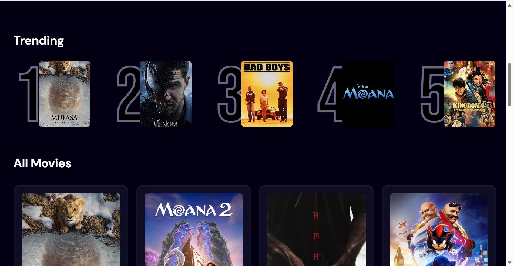

# Overview

This is a `React.js` app, that incorporates `appwrite` for backend as a service features. The app allows users to fetch movies and see list of trending movies.

## Features
### Search
1. The app allows users to search for movies - which are fetched from [TMDB](https://www.themoviedb.org/) API
2. The application utilizes React useState hook to track the state of all movies and trending movies
3. To enhance optimization, the app incorporates `useDebounce`

    - Optimizes search thus sparing server resources
    - Helps in dealing with rate limiter issues

### Data storage 
1. The app utilizes [appwrite](https://appwrite.io/) for backend services
2. The service stores user searches and users these search history to recommend to the user a list of trending movies.
   

## Tech stack
This application is a fully fledged platform that incorporates both the frontend and the backend
### Frontend
1. React.js

    Under React.js, the app incorporates React hooks such as useState for state management, useEffect and useDebounce for debounce hence an optimized search experience.

2. TailwindCSS

    This has been used for styling, ensuring that the app is intuitive, user friendly and responsive across different screens

3. Flowbite

    This has been used for simulating loading functionality using prebuilt spinners

4. Typescript

    To ensure that the app is fully fledged, clean and with no major bugs, the app has incorporated `Typescript` for static typing - hence code optimization

### Backend
1. appwrite

    For faster the development, the app utilizes appwrite for `Backend as a Service` feature

## Getting started
To get started with this application,
1. Clone the repo

    - Head over to a preferred directory on your local computer. In the terminal run
    `git clone https://github.com/Stephen100Mwangi/movieHub.git`

2. Install all packages

    - Navigate to root folder
    `cd react19`

    - Install packages
    `npm i`

3. Run the code
    
    - While inside the `react19` folder, run the command
    `npm run dev`